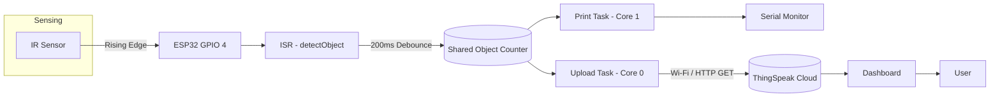

# 📡 Interrupt-to-Task Communication Using ESP32

Real-time ESP32-based object detection and counting system using **GPIO hardware interrupts**, **FreeRTOS dual-core tasks**, software debouncing, Wi-Fi, HTTP, and **ThingSpeak** cloud monitoring.

> Embedded Systems / IoT Project — Dept. of Electronics & Telecommunication Engineering, Symbiosis Institute of Technology, Pune

---

## 📌 Overview

This project demonstrates **interrupt-driven object detection** paired with **FreeRTOS task-based processing** on the ESP32.

An IR sensor on **GPIO 4** triggers a hardware interrupt on every rising edge. The Interrupt Service Routine (ISR) applies a 200ms software debounce and safely increments a shared object counter inside a critical section. Two independent FreeRTOS tasks — pinned to separate cores — then consume this data:

- **Print Task** (Core 1): displays the live object count on the Serial Monitor
- **Upload Task** (Core 0): periodically pushes the count to ThingSpeak over Wi-Fi/HTTP

The result is a real-time, dual-core embedded pipeline covering interrupt handling, synchronization, and IoT cloud reporting end-to-end.

---

## ⚙️ How It Works

1. IR sensor detects an object and its output changes state.
2. This triggers a **rising-edge hardware interrupt** on ESP32 GPIO 4.
3. The `detectObject()` ISR fires, checks the 200ms debounce window, and — if valid — increments `objectCount` inside a critical section.
4. The **Print Task** polls the counter and prints any change to the Serial Monitor.
5. The **Upload Task** periodically reads the counter and, if Wi-Fi is connected, sends it to ThingSpeak via an HTTP GET request.
6. The system idles until the next detection event.

---

## 🏛️ System Architecture



---

## 🧠 Software / RTOS Architecture

| Task | Core | Responsibility |
|---|---|---|
| `uploadTask` | Core 0 | Reads counter, uploads to ThingSpeak every 15s |
| `printTask` | Core 1 | Polls counter every 200ms, prints on change |

The shared `objectCount` variable is protected with `portENTER_CRITICAL()` / `portEXIT_CRITICAL()` (and the ISR-safe variants) whenever it's accessed from the ISR or either task, preventing race conditions across cores.

```cpp
pinMode(SENSOR_PIN, INPUT);
attachInterrupt(digitalPinToInterrupt(SENSOR_PIN), detectObject, RISING);

xTaskCreatePinnedToCore(uploadTask, "Upload Task", 4096, NULL, 1, NULL, 0);
xTaskCreatePinnedToCore(printTask,  "Print Task",  2048, NULL, 1, NULL, 1);
```

---

## 🔧 Hardware

| Component | Purpose |
|---|---|
| ESP32 Dev Board | Main microcontroller + Wi-Fi interface |
| IR Sensor | Object detection (digital output → GPIO 4) |
| USB Cable | Power, programming, serial communication |
| Wi-Fi Network | Internet connectivity for cloud upload |

**Pin mapping:** IR Sensor Output → **GPIO 4**

---

## 💻 Technologies Used

| Category | Technology |
|---|---|
| Microcontroller | ESP32 |
| Language | Embedded C/C++ |
| Framework | Arduino |
| RTOS | FreeRTOS (dual-core task pinning) |
| Sensor | IR Sensor |
| Wireless | Wi-Fi |
| Protocol | HTTP |
| Cloud | ThingSpeak |
| IDE | Arduino IDE |

---

## 🚀 Setup & Installation

**Requirements:** ESP32 board, IR sensor, USB cable, Arduino IDE with ESP32 board support, Wi-Fi network, ThingSpeak account.

1. Clone this repository and open the `.ino` file in Arduino IDE.
2. Install/select ESP32 board support and the correct COM port.
3. Wire the IR sensor output to **GPIO 4**.
4. Set your Wi-Fi and ThingSpeak credentials (see below).
5. Upload the firmware and open the Serial Monitor at **115200 baud**.
6. Pass objects in front of the IR sensor and watch the counter update.

### Configuration

> ⚠️ Never commit real credentials or API keys to a public repository.

```cpp
const char* ssid = "YOUR_WIFI_SSID";
const char* password = "YOUR_WIFI_PASSWORD";
String apiKey = "YOUR_THINGSPEAK_API_KEY";
```

Configure your ThingSpeak channel's `field1` to receive the object count.

### Expected Serial Output

```
Connecting to WiFi....
Connected!

Object Count: 1
Object Count: 2
Object Count: 3

Uploaded Count: 3 | Response: 200
```

---

## 📝 Technical Note

The abstract/conclusion of the original project report describe this as a **queue-based** ISR-to-task mechanism. The actual firmware, however, uses a **shared `volatile` counter protected by critical sections** (`portENTER_CRITICAL` / `portEXIT_CRITICAL_ISR`) — not `xQueueSendFromISR()` / `xQueueReceive()`. This README documents the mechanism as implemented rather than as originally described. A queue-based rewrite is listed under Future Improvements below.

---

## 🏭 Applications

- Automatic door systems
- Industrial conveyor-belt object counting
- Smart parking systems (vehicle entry/exit detection)
- Security and intrusion detection
- Smart home automation
- General-purpose IoT object monitoring

## 🔭 Future Improvements

- Replace the shared-counter pattern with genuine FreeRTOS queue-based ISR-to-task communication (`xQueueSendFromISR`)
- Add an OLED/LCD for local count display
- Support multiple sensors for multi-point counting
- Add automatic Wi-Fi reconnection handling
- Explore MQTT as an alternative to HTTP polling
- Add timestamps and event logging
- Add threshold-based push notifications
- Build a dedicated web/mobile dashboard

---
