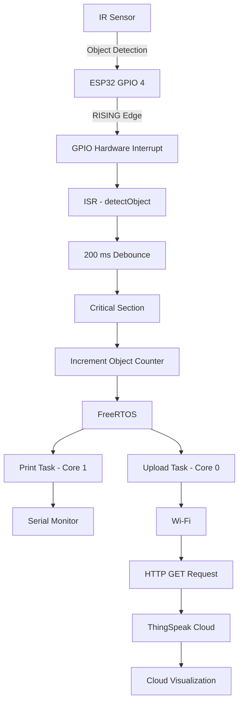
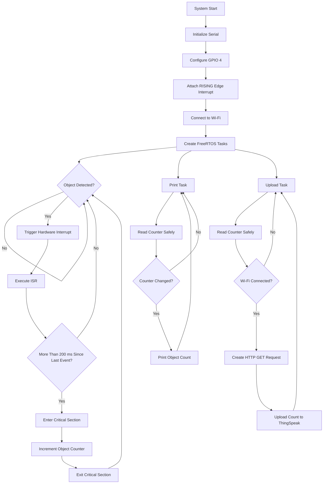
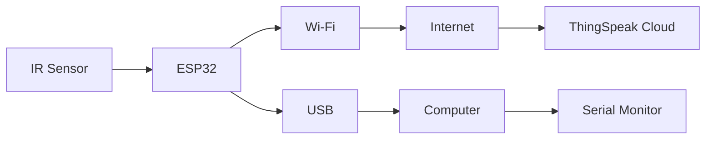
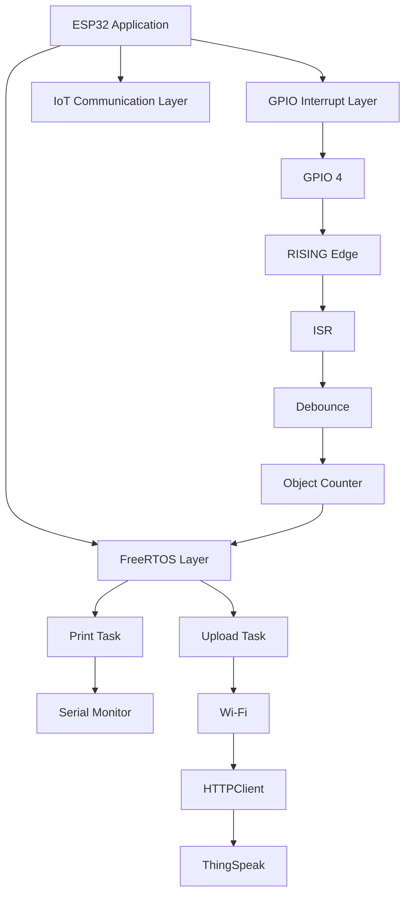
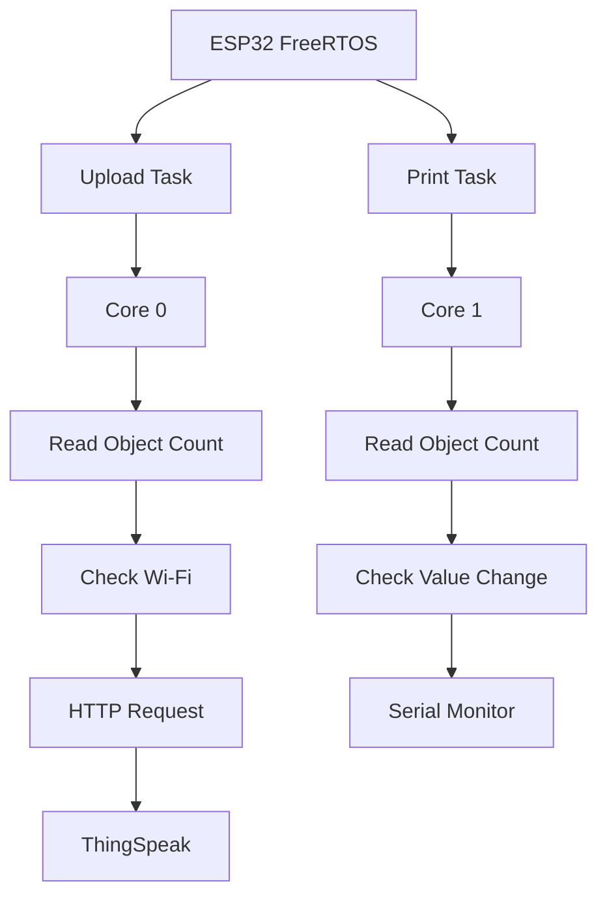
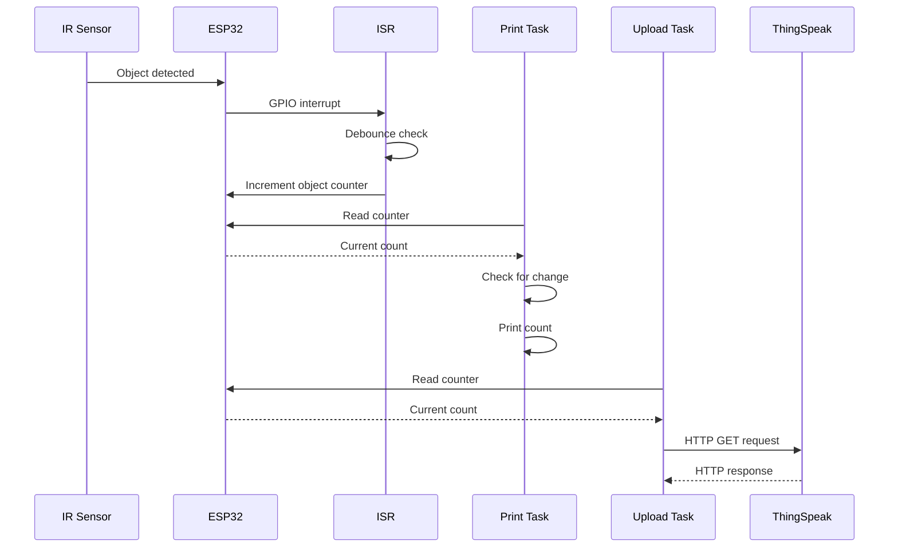

# ⚡ Interrupt-to-Task Communication Using ESP32

> **A real-time ESP32-based IoT system demonstrating hardware interrupt-driven object detection, FreeRTOS task management, safe shared-data handling, software debouncing, Wi-Fi communication, and ThingSpeak cloud monitoring.**

---

## 📌 Project Overview

This project demonstrates **interrupt-to-task communication using an ESP32 microcontroller and FreeRTOS**.

An **IR sensor** is connected to GPIO 4 of the ESP32 and configured to generate a hardware interrupt when an object is detected. The Interrupt Service Routine (ISR) processes the detection event and safely increments the object counter.

The object count is then handled by two independent **FreeRTOS tasks**:

- **Print Task** — displays the object count on the Serial Monitor.
- **Upload Task** — periodically uploads the object count to ThingSpeak through Wi-Fi.

A **200 ms software debounce mechanism** using `micros()` is implemented to reduce false or repeated detections caused by sensor noise.

The project combines **embedded systems, interrupt-driven programming, FreeRTOS, sensor interfacing, Wi-Fi communication, HTTP communication, and IoT cloud monitoring** in a single practical implementation.

---

## 🎯 Objectives

The main objectives of this project are:

- Interface an IR sensor with the ESP32.
- Implement GPIO-based hardware interrupts.
- Understand the operation of an Interrupt Service Routine (ISR).
- Implement interrupt-driven object detection.
- Perform real-time object counting.
- Use FreeRTOS tasks for independent processing.
- Safely access shared data using critical sections.
- Implement software debouncing.
- Establish Wi-Fi connectivity using ESP32.
- Transmit object-count data through HTTP.
- Upload data to ThingSpeak for cloud monitoring.
- Demonstrate task execution across the ESP32's cores.

---

## 🧠 Key Features

| Feature | Implementation |
|---|---|
| Microcontroller | ESP32 |
| Sensor | IR Sensor |
| Sensor Input | GPIO 4 |
| Detection Method | Hardware GPIO Interrupt |
| Interrupt Trigger | RISING Edge |
| ISR | `detectObject()` |
| RTOS | FreeRTOS |
| Print Task | Core 1 |
| Upload Task | Core 0 |
| Shared Variable | `objectCount` |
| Data Protection | Critical Section |
| Debouncing | `micros()` |
| Debounce Interval | 200 ms |
| Wireless Communication | Wi-Fi |
| Communication Protocol | HTTP |
| Cloud Platform | ThingSpeak |
| Serial Communication | Serial Monitor |
| Task Delay | `vTaskDelay()` |
| Task Creation | `xTaskCreatePinnedToCore()` |

The project report specifies GPIO 4, a rising-edge interrupt, critical-section protection, and 200 ms software debouncing. :contentReference[oaicite:1]{index=1}

---

# 🏗️ System Architecture


# 🔄 Working Principle



---

# ⚙️ Detailed Working

## 1. Object Detection

The IR sensor detects the presence of an object and changes its output signal.

The sensor output is connected to:

```text
IR Sensor OUT → ESP32 GPIO 4
```

GPIO 4 is configured as an interrupt input.

---

## 2. Hardware Interrupt

The interrupt is configured using:

```cpp
attachInterrupt(
    digitalPinToInterrupt(SENSOR_PIN),
    detectObject,
    RISING
);
```

The ESP32 responds to the **RISING edge** generated by the IR sensor.

This allows the microcontroller to respond to an object-detection event without continuously polling the sensor.

---

## 3. Interrupt Service Routine

The ISR is:

```cpp
void IRAM_ATTR detectObject()
```

Inside the ISR, `micros()` is used to determine the time since the previous interrupt.

```cpp
unsigned long now = micros();
```

---

## 4. Software Debouncing

A debounce interval of **200 ms** is implemented.

```cpp
if (now - lastInterruptTime > 200000)
```

If another interrupt occurs within this interval, it is ignored.

This helps reduce false or repeated counts caused by rapid sensor transitions or noise.

---

## 5. Object Counter

When a valid detection occurs, the object counter is incremented:

```cpp
objectCount++;
```

Because the counter is accessed from interrupt and task contexts, critical sections are used to protect access to the shared variable.

---

## 6. FreeRTOS Print Task

The Print Task runs independently and reads the object counter safely.

It prints the count only when the value changes.

```cpp
if (safeCount != lastPrinted) {
    Serial.print("Object Count: ");
    Serial.println(safeCount);
}
```

The Print Task is assigned to **Core 1**.

---

## 7. FreeRTOS Upload Task

The Upload Task periodically reads the object counter and sends it to ThingSpeak.

The report's implementation uses:

```cpp
vTaskDelay(15000 / portTICK_PERIOD_MS);
```

Therefore, the upload task waits approximately **15 seconds between upload cycles**.

The task uses the ESP32 Wi-Fi connection and `HTTPClient` to send an HTTP GET request.

---

## 8. Cloud Communication

The object count is sent to ThingSpeak using an HTTP request.

The request contains:

```text
API Key
+
Field 1
+
Object Count
```

The cloud platform can then visualize the received object-count data.

---

# 🧩 Hardware Architecture



---

# 🔌 Hardware Components

| Component | Purpose |
|---|---|
| ESP32 Development Board | Main microcontroller, processing and Wi-Fi |
| IR Sensor | Object detection |
| USB Cable | Programming, power and serial communication |
| Computer | Programming and Serial Monitor |
| Wi-Fi Network | Internet connectivity |
| ThingSpeak | Cloud monitoring |

---

# 📍 Pin Configuration

| Component | ESP32 Pin |
|---|---|
| IR Sensor Output | GPIO 4 |

### Sensor Connection

```text
IR Sensor              ESP32
─────────              ─────
VCC       ───────────► 3.3V / Appropriate Supply
GND       ───────────► GND
OUT       ───────────► GPIO 4
```

---

# 💻 Software Architecture


---

# 🧵 FreeRTOS Task Architecture

The project uses two FreeRTOS tasks.



### Task Allocation

| Task | Core | Main Function |
|---|---:|---|
| Upload Task | Core 0 | Upload object count to ThingSpeak |
| Print Task | Core 1 | Display object count on Serial Monitor |

The report creates the Upload Task on Core 0 and Print Task on Core 1 using `xTaskCreatePinnedToCore()`. :contentReference[oaicite:3]{index=3}

---

# 🔐 Shared Data Protection

The object counter is shared between the ISR and FreeRTOS tasks.

The project declares:

```cpp
volatile int objectCount = 0;
```

A `portMUX_TYPE` is used:

```cpp
portMUX_TYPE mux = portMUX_INITIALIZER_UNLOCKED;
```

The ISR protects the counter using:

```cpp
portENTER_CRITICAL_ISR(&mux);

objectCount++;

portEXIT_CRITICAL_ISR(&mux);
```

The FreeRTOS tasks similarly protect their access:

```cpp
portENTER_CRITICAL(&mux);

safeCount = objectCount;

portEXIT_CRITICAL(&mux);
```

This provides protected access to the shared counter.

---


# 🌐 Wi-Fi and HTTP Communication

The ESP32 connects to a Wi-Fi network using:

```cpp
WiFi.begin(ssid, password);
```

The connection is checked using:

```cpp
WiFi.status() == WL_CONNECTED
```

The project uses the Arduino `HTTPClient` library to create an HTTP GET request.

The request sends the current object count to ThingSpeak.

---

# ☁️ ThingSpeak Integration

The cloud upload process follows:

```text
ESP32
  ↓
Wi-Fi
  ↓
HTTP GET
  ↓
ThingSpeak API
  ↓
ThingSpeak Channel
  ↓
Object Count Visualization
```

The object count is transmitted to **Field 1** of the ThingSpeak channel.

---

# 🛠️ Technologies Used

## Hardware

- ESP32
- IR Sensor
- USB Cable
- Computer

## Programming

- C/C++
- Arduino Framework
- Arduino IDE

## Real-Time Operating System

- FreeRTOS

## Communication

- GPIO Interrupt
- Wi-Fi
- HTTP

## Cloud

- ThingSpeak

## Libraries

```cpp
#include <WiFi.h>
#include <HTTPClient.h>
```

---


# 🚀 Getting Started

## Prerequisites

Before running the project, you need:

- ESP32 development board
- IR sensor
- USB cable
- Arduino IDE
- ESP32 board package
- Wi-Fi network
- ThingSpeak account/channel

---

## 1. Clone the Repository

```bash
git clone https://github.com/YOUR_USERNAME/ESP32-Interrupt-to-Task-Communication.git
```

```bash
cd ESP32-Interrupt-to-Task-Communication
```

---

## 2. Open the Project

Open the `.ino` file using Arduino IDE.

Select:

```text
Tools → Board → ESP32 Board
```

Select the appropriate COM port.

---

## 3. Configure Wi-Fi

Do not directly publish your credentials.

Use:

```cpp
const char* ssid = "YOUR_WIFI_SSID";
const char* password = "YOUR_WIFI_PASSWORD";
```

---

## 4. Configure ThingSpeak

Create your ThingSpeak channel and use your own API key:

```cpp
String apiKey = "YOUR_THINGSPEAK_API_KEY";
```

---

## 5. Connect the Hardware

Connect the IR sensor output to:

```text
GPIO 4
```

Connect:

```text
IR VCC → ESP32 Supply
IR GND → ESP32 GND
IR OUT → GPIO 4
```

---

## 6. Upload the Code

Compile and upload the program to the ESP32 using Arduino IDE.

---

## 7. Open Serial Monitor

Open:

```text
Tools → Serial Monitor
```

Set:

```text
Baud Rate: 115200
```

Place objects in front of the IR sensor and observe the object counter.

---

# 🔒 Security

**Never commit credentials or API keys to a public GitHub repository.**

Use placeholders:

```cpp
const char* ssid = "YOUR_WIFI_SSID";
const char* password = "YOUR_WIFI_PASSWORD";
String apiKey = "YOUR_THINGSPEAK_API_KEY";
```

A `.gitignore` file can also be used to prevent configuration files containing secrets from being committed.

Example:

```text
config.h
secrets.h
.env
```

---

# 📈 Demonstration Sequence



---

# 🎯 Engineering Skills Demonstrated

This project demonstrates practical experience in:

### Embedded Systems

- ESP32 programming
- GPIO configuration
- Sensor interfacing
- Interrupt-driven programming
- ISR implementation

### Real-Time Systems

- FreeRTOS task creation
- Task scheduling
- Task delays
- Dual-core task assignment
- Shared-data protection
- Critical sections

### IoT

- Wi-Fi connectivity
- HTTP communication
- Cloud data transmission
- ThingSpeak integration

### Software Development

- C/C++ programming
- Arduino framework
- Modular task-based design
- Debugging using Serial Monitor

---

# 🧪 Testing

The system can be tested by placing objects in front of the IR sensor.

### Test Sequence

```text
1. Power ON ESP32
        ↓
2. ESP32 initializes peripherals
        ↓
3. ESP32 connects to Wi-Fi
        ↓
4. FreeRTOS tasks start
        ↓
5. Place object near IR sensor
        ↓
6. GPIO interrupt is generated
        ↓
7. ISR executes
        ↓
8. Object counter increments
        ↓
9. Print Task displays count
        ↓
10. Upload Task sends count to ThingSpeak
```

---

# 🔮 Future Improvements

The current implementation can be extended with:

- OLED or LCD display
- Multiple IR sensors
- Queue-based ISR-to-task communication
- FreeRTOS queues and semaphores
- Wi-Fi reconnection handling
- MQTT-based cloud communication
- Mobile application integration
- Real-time notifications
- Timestamp-based event logging
- Local data storage
- Threshold-based alerts
- Power optimization
- Battery-powered operation
- Web-based monitoring dashboard

---

# 🌍 Applications

The system architecture can be adapted for several real-world applications:

### 🚪 Automatic Door Systems

IR detection can be used as an input for automatic door control.

### 🏭 Industrial Conveyor Systems

The system can count products moving through a manufacturing or packaging line.

### 🚗 Smart Parking

Sensors can be used to detect vehicle entry and exit events.

### 🛡️ Security Systems

The system can detect movement or objects in restricted areas.

### 🏠 Smart Home Automation

Sensor events can be used as triggers for automation.

These application areas are also identified in the project report. :contentReference[oaicite:4]{index=4}

---

# 📚 Learning Outcomes

Through this project, the following concepts were practically implemented and studied:

- ESP32 architecture and programming
- GPIO interrupt handling
- Interrupt Service Routines
- IR sensor interfacing
- Real-time object counting
- FreeRTOS task management
- Dual-core task assignment
- Critical sections
- Shared-variable protection
- Software debouncing
- Wi-Fi networking
- HTTP communication
- ThingSpeak cloud integration
- IoT data monitoring
- Real-time embedded system design

---

# ⚠️ Important Technical Note

The project report refers to **queue-based communication** in its abstract and conclusion. However, the implementation shown in the report uses a **shared `objectCount` variable protected by critical sections**, rather than an actual FreeRTOS queue. :contentReference[oaicite:5]{index=5} :contentReference[oaicite:6]{index=6}

Therefore, this repository describes the implemented mechanism as:

```text
Interrupt
    ↓
ISR
    ↓
Protected Shared Counter
    ↓
FreeRTOS Tasks
```

rather than claiming that the current code uses `xQueueSendFromISR()` or `xQueueReceive()`.

---

# 🔐 Credential Protection

The original project code contains Wi-Fi credentials and a ThingSpeak API key. **These values should not be committed to a public repository.** :contentReference[oaicite:7]{index=7}

Before pushing the project to GitHub, replace them with:

```cpp
const char* ssid = "YOUR_WIFI_SSID";
const char* password = "YOUR_WIFI_PASSWORD";
String apiKey = "YOUR_THINGSPEAK_API_KEY";
```

If credentials have already been pushed to a public repository, rotate/revoke those credentials before making the repository public.

---
